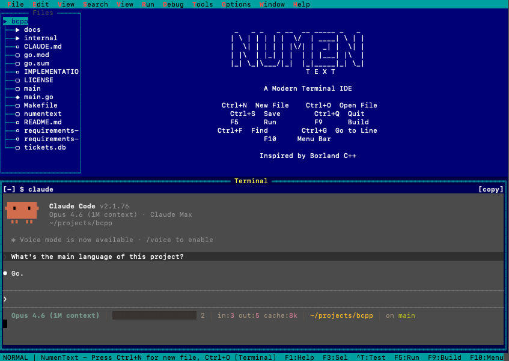
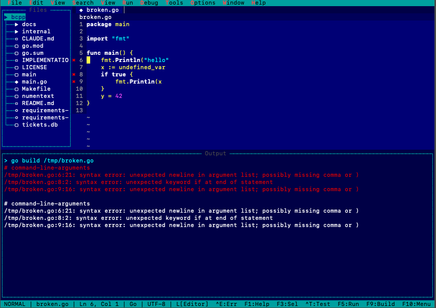
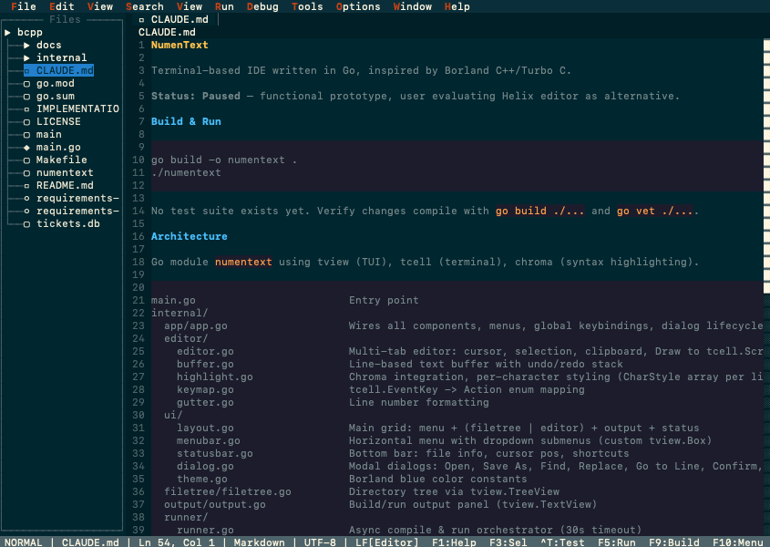
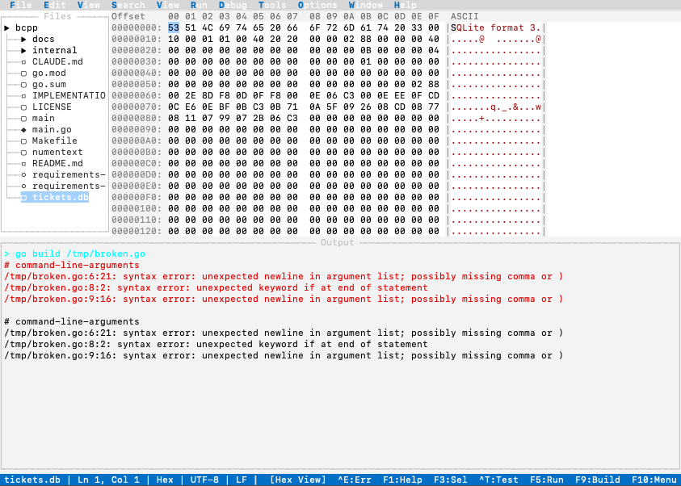

# NumenText

A terminal-based IDE written in Go, inspired by Borland C++ and Turbo C.

NumenText is a non-modal, menu-driven editor for people who want a capable IDE in the terminal without learning vim or modal editing. Familiar shortcuts (Ctrl+S, Ctrl+C, F5 to run) work out of the box.


*Embedded PTY terminal with Claude Code running inside NumenText -- Borland theme*

## Features

- **Multi-tab editor** with syntax highlighting (via Chroma) for 20+ languages
- **Integrated terminal** with PTY support and command block mode
- **LSP client** -- autocomplete, go-to-definition, hover info, diagnostics (auto-detects gopls, pyright, clangd, rust-analyzer, typescript-language-server, kotlin-language-server, jdtls)
- **DAP client** -- debugger integration with breakpoints, step over/in/out (dlv, debugpy, lldb-vscode, JVM JDWP)
- **Build and run** -- F5 to run, F9 to build (C, C++, Go, Rust, Python, JavaScript, TypeScript, Java, Kotlin)
- **Build error navigation** -- F9 to build, Ctrl+E to cycle through errors with gutter markers
- **Unit test runner** -- Ctrl+T to run tests, parses go test, pytest, cargo test, Maven, Gradle output
- **Configurable formatters and linters** -- format-on-save, lint-on-save, per-language tool config
- **Regex search and replace** -- across current file or all open files with capture group support
- **Markdown live preview** -- inline formatting, code blocks, tables, blockquotes with marker hiding
- **Binary hex viewer/editor** -- two-pane hex+ASCII view with editing, undo/redo
- **File bookmarks** -- Ctrl+F2 to toggle, F2/Shift+F2 to navigate, bookmarks panel
- **TODO/FIXME scanner** -- detects annotation tags in comments across all open files
- **Git diff gutter markers** -- green/red/blue markers for added/deleted/modified lines
- **Block/column selection** -- Alt+Shift+Arrow or Alt+Shift+mouse drag
- **File tree** with directory browsing
- **Command palette** (Ctrl+Shift+P) and quick file open (Ctrl+P)
- **Tab switcher** with overflow dropdown for large sessions
- **Resizable panels** -- keyboard (Ctrl+Shift+Arrows) or mouse drag
- **Vi and Helix keybinding modes** (Ctrl+Shift+M to cycle)
- **4 built-in themes** -- Borland, Modern Dark, Modern Light, Solarized Dark
- **Line endings** -- detect and preserve LF/CRLF/CR, UTF-8 BOM handling
- **HTML tools** -- encode/decode entities, entity picker
- **Python venv support** -- auto-detects virtual environments for tool execution
- **LSP install prompting** -- suggests install commands for missing language servers
- **F1 searchable help** -- keyboard shortcut reference with filtering
- **Persistent config** -- panel sizes, recent files, preferences saved to `~/.numentext/config.json`
- **Single binary**, no runtime dependencies

## Screenshots

### Build Error Navigation

*F9 to build, cursor jumps to first error. Ctrl+E cycles through errors with "Error N of M" in status bar. Red gutter markers show error locations -- Borland theme*

### Markdown Live Preview

*Markdown rendered with hidden markers: bold headers, tinted code blocks, inline code spans. Markers appear when cursor is on the line for editing -- Modern Dark theme*

### Binary Hex Viewer

*Binary file auto-detected and opened in hex view. Address column, 16 bytes per row with 8+8 grouping, synchronized ASCII pane -- Modern Light theme*

## Install

### Homebrew (macOS and Linux)

```
brew install numentech-co/tap/numentext
```

### Shell installer

```
curl -fsSL https://raw.githubusercontent.com/numentech-co/numentext/main/install.sh | sh
```

To install to a custom directory:

```
INSTALL_DIR=~/.local/bin curl -fsSL https://raw.githubusercontent.com/numentech-co/numentext/main/install.sh | sh
```

### From source

Requires Go 1.25 or later.

```
git clone https://github.com/numentech-co/numentext.git
cd numentext
go build -o numentext .
./numentext
```

### Running on a Remote Machine

NumenText is a single binary with no dependencies. Cross-compile locally and copy it over:

```bash
# For Linux AMD64
GOOS=linux GOARCH=amd64 go build -o numentext-linux .

# For Linux ARM64 (e.g., AWS Graviton)
GOOS=linux GOARCH=arm64 go build -o numentext-linux .

# Copy to remote and run
scp numentext-linux user@your-server:~/numentext
ssh -t user@your-server ./numentext
```

The `-t` flag ensures SSH allocates a TTY, which the terminal UI requires.

**Known limitations over SSH:**

- **Clipboard** -- Ctrl+C/V use the local system clipboard (pbcopy/xclip), which is not available over SSH. The internal yank/paste and editor clipboard still work. OSC 52 clipboard passthrough is not yet supported.
- **Shift+Arrow selection** -- Some SSH clients and terminal multiplexers (tmux, screen) intercept or strip modifier keys from arrow sequences. Use **F3** (selection mode toggle) as a reliable alternative.
- **Latency** -- Every keystroke round-trips to the server. For high-latency connections, consider [mosh](https://mosh.org/) instead of SSH for better responsiveness.
- **Terminal type** -- Set `TERM=xterm-256color` on the remote machine for full color and Unicode support. Basic terminals (`TERM=linux`, `TERM=vt100`) automatically fall back to ASCII mode.

## Keyboard Shortcuts

| Shortcut | Action |
|----------|--------|
| Ctrl+N | New file |
| Ctrl+O | Open file |
| Ctrl+S | Save |
| Ctrl+W | Close tab |
| Ctrl+Q | Quit |
| Ctrl+Z / Ctrl+Y | Undo / Redo |
| Ctrl+X / Ctrl+C / Ctrl+V | Cut / Copy / Paste |
| Ctrl+F | Find (with regex toggle) |
| Ctrl+H | Replace |
| Ctrl+G | Go to line |
| Ctrl+B | Go to matching bracket |
| Ctrl+E | Next build error / search result |
| Ctrl+T | Run tests |
| Ctrl+P | Quick file open |
| Ctrl+Shift+P | Command palette |
| Ctrl+Shift+F | Search in files |
| Ctrl+Shift+I | Format file |
| Ctrl+Shift+L | Lint file |
| Ctrl+Shift+A | Toggle TODO/FIXME panel |
| F1 | Help (searchable shortcut reference) |
| Ctrl+F1 | Word-under-cursor help (LSP hover) |
| F2 / Shift+F2 | Next / Previous bookmark |
| Ctrl+F2 | Toggle bookmark |
| F3 | Toggle selection mode |
| F5 | Run |
| F9 | Build |
| F10 | Menu bar |
| F11 | Hover info (LSP) |
| F12 | Go to definition (LSP) |
| F8 | Toggle breakpoint |
| F6 | Debug continue |
| F7 | Step over |
| Ctrl+` | Toggle terminal |
| Ctrl+Tab | Next tab |
| Ctrl+] | Next panel |
| Ctrl+Shift+Arrows | Resize panels |
| Ctrl+Shift+M | Cycle keyboard mode |

## Architecture

```
main.go                        Entry point
internal/
  app/app.go                   Wires components, menus, keybindings, dialogs
  editor/                      Multi-tab editor with buffer, undo/redo, completion
  terminal/                    VT100 state machine + PTY via creack/pty
  lsp/                         JSON-RPC 2.0 LSP client
  dap/                         DAP client for debugging
  hexview/                     Binary hex viewer/editor
  ui/                          MenuBar, StatusBar, Dialogs, Themes
  runner/                      Build/run/test orchestrator for multiple languages
  filetree/                    Directory tree panel
  config/                      Persistent config (~/.numentext/config.json)
```

The design philosophy: stay a small, fast Go binary that delegates intelligence to protocols (LSP, DAP) rather than reimplementing language features.

## Contributing

Contributions are welcome. Please follow these guidelines:

### Getting Started

1. Fork the repository
2. Create a feature branch: `git checkout -b my-feature`
3. Make your changes
4. Ensure the build passes: `go build ./... && go vet ./...`
5. Submit a pull request

### Code Guidelines

- **Keep it simple.** NumenText is intentionally minimal. Don't add features that aren't needed yet.
- **Style-aware UI.** All UI characters (borders, icons, indicators) must come from the style registry (`ui.Style`), never hardcoded. Classic mode uses ASCII only; modern mode uses Unicode. Never use emoji.
- **Escape tview brackets.** All user-facing text must avoid literal `[` and `]` -- tview interprets them as color tags. Use `tview.Escape()`.
- **No `app.Draw()` in input handlers.** tview redraws automatically after input. Manual calls cause re-entrancy freezes.
- **Test your changes compile.** `go build ./...`, `go vet ./...`, and `go test ./...` must pass.
- **One concern per PR.** Keep pull requests focused on a single change.

### Reporting Issues

Open an issue with:
- What you expected to happen
- What actually happened
- Your terminal emulator and OS
- Steps to reproduce

## License

Apache License 2.0. See [LICENSE](LICENSE) for details.
